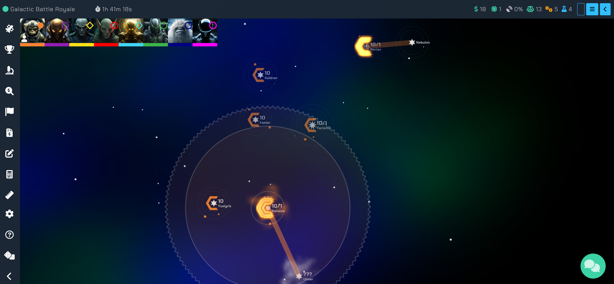

# Cosmic Odyssey

Cosmic Odyssey is a gradually unfolding browser game, drawing significant inspiration from [Solaris](https://solaris.games), [Neptune's Pride](https://np.ironhelmet.com), and [Subterfuge](http://subterfuge-game.com/).

- Develop economic, scientific, and industrial frameworks to strengthen your dominion.
- Construct vessels to explore new celestial bodies or combat adversaries.
- Delve into innovative technologies for a competitive advantage.
- Engage experts who provide unique abilities to stars and vessels, enhancing weaponry and hyperspace range.
- Initiate trade relationships with allies for a strategic edge.
- Engage in multiplayer sessions with up to 32 participants.
- Collaborate in group discussions with teammates to plan tactics.
- Challenge rival players and seize star system points for victory.
- Matches typically span 2-3 weeks, requiring minimal time investment!
- Accessible on any device equipped with a web browser.
- Absolutely no cost involved!

# 🚀 Dive into the game at [Cosmic-Odyssey.io](https://cosmic-odyssey.io/)

## 🛠 Backend Tech Stack

Our server harnesses the power of:
- **Node.js** - [https://nodejs.org/en/](https://nodejs.org/en/)
- **Express** - [https://expressjs.com/](https://expressjs.com/)
- **MongoDB** - [https://www.mongodb.com/](https://www.mongodb.com/)
  - *Mongoose* - [https://mongoosejs.com/](https://mongoosejs.com/)

## 🖥 Frontend Tech Stack

On the client-side, we use:
- **Vue.js** - [https://vuejs.org/](https://vuejs.org/)
- **PixiJS** - [https://www.pixijs.com/](https://www.pixijs.com/)

## 🛠 Setting Up the Dev Environment

1. Get the essential tools:
   - **Node.js v14** - [https://nodejs.org/en/](https://nodejs.org/en/)
   - **MongoDB v4.4** - [https://www.mongodb.com/](https://www.mongodb.com/)
2. Clone the given repository.
3. Access the `master` branch.
4. Run `npm install` within both `client/` and `server/` folders.
5. Initiate a `.env` file in `server/` (refer to `.env.example`).
6. Similarly, create a `.env` file in `client/` (use `.env.example` as reference).
7. Execute `npm run start-jobs:dev` in `server/` to kick off automated processes and set up new game instances.
8. Start the API with `npm run start-api:dev` in `server/`.
9. Launch the client app with `npm run serve` in the `client/` directory.
10. Visit the locally-hosted site, typically at [http://localhost:8080](http://localhost:8080).

> **Reminder:** Begin all developmental tasks from the `main` branch. For new functionalities or troubleshooting, branch off from `main`.

### 📊 Database Updates

To stay in sync:
1. Run `npm run start-db-migrate:dev` in `server/` to bring your local database up-to-date.

> **Note:** This assumes a `Cosmic Odyssey` database presence on your system. If it's absent, revisit the **Dev Environment Setup** steps.

### 🔄 Streamlining Dev Setup (Bonus)

For a seamless experience, consider **PM2**:
- **PM2** - [https://pm2.keymetrics.io/](https://pm2.keymetrics.io/)

1. Install `pm2`.
2. Trigger `pm2 start pm2.config.js` to initiate `pm2` applications.

Once set, this will initiate server jobs, the API, and client applications, and monitor for changes. The debugger attach for VS Code, specified in `.vscode/launch.json`, will aid in the process.

After these configurations, access the local site as usual ([http://localhost:8080](http://localhost:8080)). Any edits will auto-refresh the apps.

## 🤝 How to Contribute

Check our guidelines [here](CONTRIBUTING.md).

## 📜 Licensing

See the details [here](LICENSE).

